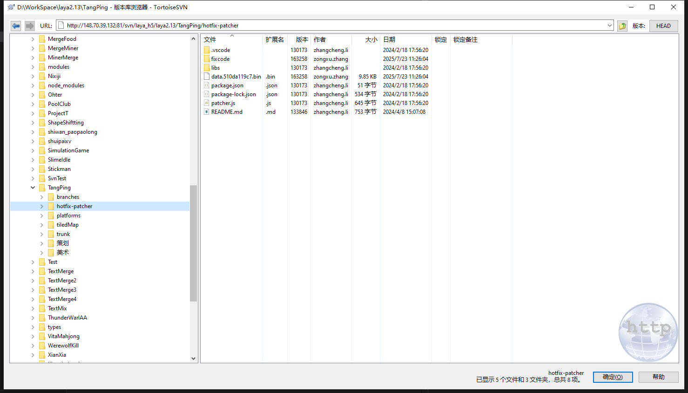

# 对支持热更新的项目进行热更新

## 流程
1. 从 SVN 服务器上拉取 hotfix-patcher 文件夹。

2. 使用 VSCode 打开 hotfix-patcher 文件夹，进行热更新代码编写，其中 code.js 为热更新代码编写处。
3. 将运行后生产的 data.xxxxxxx.bin 文件发给续哥即可。

## 注意
### 根据游戏传入的global变量来填入classMap的g变量中
- 一般都有BundleJs,fx,sdk,window等
### 使用游戏内的未压缩类名，填入到classMap的cls变量中
- 因为bundle.js导出的类名都注册了原始名字的，所以使用ts代码里面的类名即可。
### 需要打补丁的函数填入到funcs里面即可
- 注意全局变量一定要在GScope(gVal)的gVal中传入
- 引用的类，必须添加前缀比如: BundleJs.xxx
- 未传入的全局变量可以使用 window.xxx 访问
 ### F5启动编译（点击 VSCode 左侧的运行和调试，然后点 Launch Program）
- 不能使用for of
- for循环数组，需要先判断数组长度>0
- 注意：只支持es5语法, 不支持 let, 不支持 ``, 不支持 () => {} 表达式
- this 只支持第一层函数，所以要用self替代

---

### 以下为 code.js 示例
``` javascript
var classMap = [
{
    g: BundleJs,
    cls: 'FishingRodScript',
    funcs: [
        function onDestroy() {
            var self = this;
            
            self.palsyEff && self.palsyEff.destroy();
            self.barNode && self.barNode.destroy();
            self.skillBtn && self.skillBtn.destroy();
            self.cdNode && self.cdNode.destroy();
            self.img_pointer && self.img_pointer.destroy();
            self.img_fishhook && self.img_fishhook.destroy();
            self.img_fishingLine && self.img_fishingLine.destroy();
        },
        function updateFollowBtnPos(x, y) {
            var self = this;
            if (!self.skillBtn || self.skillBtn.destroyed) {
                return;
            }
            var stagePos = Game.mapMgr.mapPosToStagePos(self.node.x, self.node.y);
            var dir = self.dir.setValue(stagePos.x - x + 44, stagePos.y - y - 44);
            var angle = Math.atan2(dir.y, dir.x) * 180 / Math.PI + 90;
            self.skillBtn.rotation = angle;
            self.img_fishingLine.rotation = self.skillBtn.rotation + 180;
            self.img_pointer.rotation = angle + 180;

            if (fx.V2.scalarLength(dir) > 350) {
                dir.normalize(-350);
                self.skillBtn.pos(dir.x + stagePos.x + 44, dir.y + stagePos.y - 44);
            } else {
                self.skillBtn.pos(x, y);
            }
            console.log("---------鱼竿按钮位置热更---------");
        },
        function onInputUp() {
            var self = this;
            if (!self.skillBtn || self.skillBtn.destroyed) {
                return;
            }
            self.isDown = false;
            self.img_fishingLine.rotation = self.skillBtn.rotation + 180;
            self.skillBtn.rotation = 0;
            self.skillBtn.visible = false;
            self.img_pointer.visible = false;

            self.fishing();
        }
    ]
},
{
    g: BundleJs,
    cls: 'GameManager',
    funcs: [
        function takeDamage(from, targetData, damage) {
            var self = this;
            
            if (Game.gameMgr.gameStatus != BundleJs.GameStatus.E_GAME_START) {
                return;
            }
            if (targetData.isDie) {
                return;
            }
            if (targetData.invincible || targetData.invincible_skill) {
                return;
            }
            if (damage <= 0) {
                return;
            }
            if (targetData.reduceRate) {
                damage *= (1 - targetData.reduceRate);
            }
            if (targetData.type == BundleJs.BuildType.bed) {
                if (targetData.playerUuid) {
                    var playerData = Game.playerMgr.getPlayer(targetData.playerUuid)
                    if (playerData.invincibleCnt) {
                        playerData.invincibleCnt -= 1;
                        return;
                    }
                }
            }
            if (targetData.skillEquipHp) {
                targetData.skillEquipHp -= damage;
                if (targetData.skillEquipHp <= 0) {
                    targetData.skillEquipHp = 0;
                    targetData.ownerScript.changeSkin(false);
                }
            } else {
                targetData.curHp -= damage;
                targetData.curHp = Math.max(targetData.curHp, 0);
                if (self.gameMode == BundleJs.GameMode.E_Hunt && targetData.curHp > 0 && targetData.curHp / targetData.maxHp < 0.1) {
                    if (targetData == Game.playerMgr.player && !targetData.isShowYanluo) {
                        targetData.isShowYanluo = true;
                        fx.EventCenter.I.event(BundleJs.GameEvent.E_Yanluo_Show);
                    }
                }
            }
    
            var normalCb = new Laya.Handler(self, function () {
                targetData.isDie = (targetData.curHp == 0);
                if (targetData.owner) {
                    targetData.owner.event(BundleJs.ModelEvent.Hp_Changed, [from]);
                    targetData.owner.event(BundleJs.ModelEvent.Battle_Be_Hit, [from, damage]);
                }
                if (targetData.isDie) {
                    var data = targetData;
                    if (data.type == BundleJs.BuildType.bed && data.playerUuid) {
                        var model = Game.playerMgr.getPlayer(data.playerUuid);
                        self.takeDamage(from, model, damage);
                    }
                    if (data.type == BundleJs.BuildType.door) {
                        BundleJs.Util.playSound(121);
                        var player = Game.playerMgr.getPlayer(data.playerUuid);
                        self.heartSound(player);
                    }
                }
                if (targetData.type == BundleJs.BuildType.door && self.curHunterAtkTarget != targetData && !from.isGhost) {
                    self.curHunterAtkTarget = targetData;
                    var room = Game.mapMgr.getRoomById(targetData.roomId);
                    fx.EventCenter.I.event(BundleJs.GameEvent.E_Player_Hurt, room.bedModelList[0].playerUuid);
                }
            });
    
            if (!self.isOpenDoorFix && BundleJs.GameMode.E_Defense == self.gameMode && Game.controller.checkABTest('expt_doorFix_ad', [0, 1])) {
                var gameInfo = Game.user.gameInfo;
                var b = gameInfo.winCnt + gameInfo.failCnt > 0;
                if (b && targetData.type == BundleJs.BuildType.door && targetData.playerUuid == Game.playerMgr.mineUuid && targetData.curHp == 0) {
                    var buildResult = Game.buildingMgr.getUpgradeRet(targetData.playerUuid, targetData.x, targetData.y, false);
                    if (BundleJs.BuildResult.E_OK == buildResult) {
                        var upgradeCb = new Laya.Handler(self, function () {
                            Game.buildingMgr.upgrade(targetData.playerUuid, targetData.x, targetData.y, false, 0);
                        });
                        Game.ui.open(BundleJs.AssetUI.DoorFixDialog, { normalCb: normalCb, upgradeCb: upgradeCb });
                        self.isOpenDoorFix = true;
                    } else {
                        normalCb.run();
                    }
                } else {
                    normalCb.run();
                }
            } else {
                normalCb.run();
            }
        }
    ]
}
]

for (var index = 0; index < classMap.length; index++) {
    var info = classMap[index];
    var gVal = info.g
    var self = gVal[info.cls];
    var proto = self.prototype;
    for (var i = 0; i < info.funcs.length; i++) {
        var func = info.funcs[i];
        proto[func.name] = func;
    }
}
```