# 独立试玩上传
## 介绍
独立试玩上传是指已经制作好的独立试玩包，需要我获取到对应的试玩包的appId后手动使用微信开发者工具打开该项目，然后上传。至于为什么这么做，暂时还不清楚。（以下流程为大致流程，不确定完全正确）
## 流程
1. 从SVN服务器拉取独立试玩包，如躺平的三个试玩包
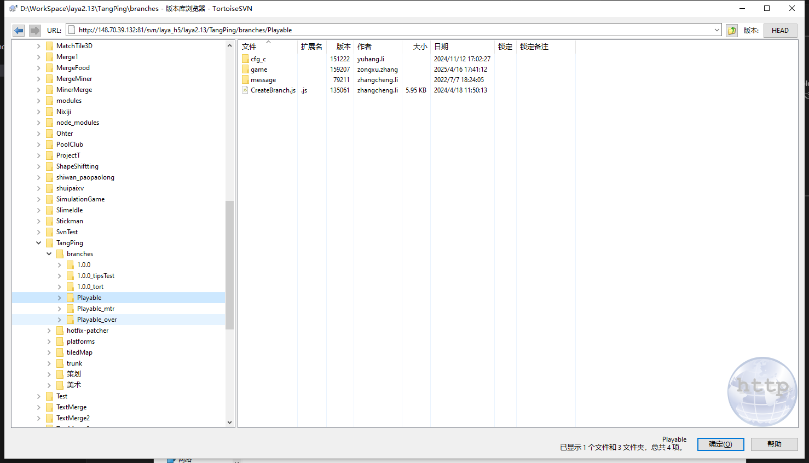
2. 别人在“微信服务商平台”创建好对应的试玩包appId，并关联好对应的小程序游戏，我们只需获取到每个试玩包对应的appId即可
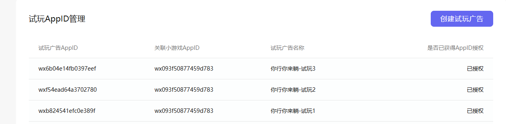
3. 使用微信开发者工具依次导入每个试玩包，导入时需要手动填写对应的AppId  
- 注意，appId一定要填写正确，如果试玩包的appId相互填错了，照样能正常使用微信开发者工具打开并上传，但这会造成莫名其妙的错误！ 
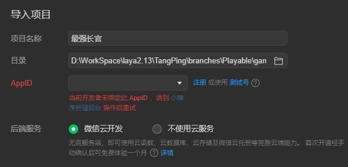  
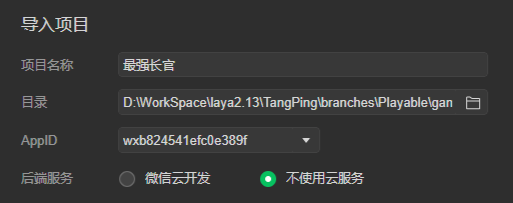
4. 直接在微信开发者工具中上传即可，并不需要更改什么东西（应该是哈，不确定）
5. 上传后，前往微信服务商平台的版本管理的开发版本中体验所上传的试玩包，没有问题即可提交
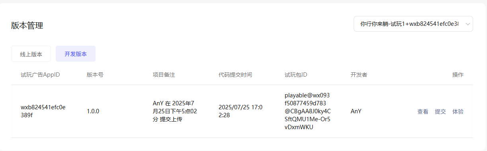

# 制作独立试玩
## 已存在试玩包的项目
### 适用于当前已存在的试玩包功能与新试玩包功能相近时使用，即在当前已存在的试玩包上实现新试玩包所需功能比较方便时使用
#### 1、在SVN服务器复制当前已存在的试玩包到新分支，并且拉取该新试玩包分支  
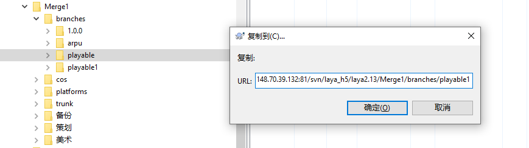
#### 2、使用Laya打开新试玩包项目，实现新试玩包所需功能
#### 3、在Laya中发布，然后导入微信开发者工具中。注意，导入时需要手动填写对应的AppId（千万不要填错）
#### 4、确定新试玩包没有问题后即可上传，然后前往微信服务商平台的版本管理的开发版本中体验所上传的试玩包，没有问题即可提交

## 不存在试玩包的项目
### 适用于新试玩包的需求与当前已存在的试玩包功能相差较大时使用，即难以在当前已存在的试玩包上实现新试玩包所需功能时使用（以下为以躺平的试玩包为模板制作硬币的新试玩包）
#### 1、从SVN服务器上拉取新试玩包对应的trunk版本  
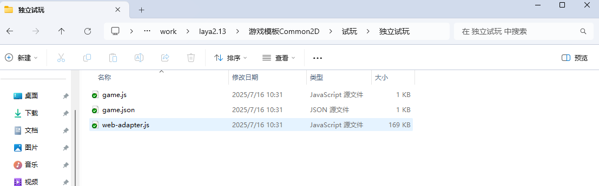
#### 2、修改 game/game.laya 中的 proName
#### 3、游戏内容修改
1. LoadingScript 与 PlayableLoadingScript
   - 从别的游戏的试玩包中复制 PlayableLoadingScript
   - 在 LoadingScene 中删除 LoadingScript 组件，挂在 PlayableLoadingScript 组件，并删除场景中不需要的元素，一般只留个背景就行
   - 修改 PlayableLoadingScript 中的内容（随着接下来的操作慢慢改，这个不会一次就成功）
2. SdkMgr.ts  
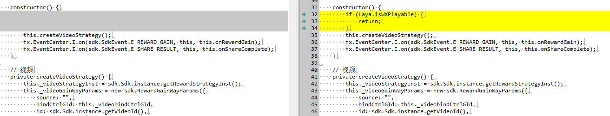
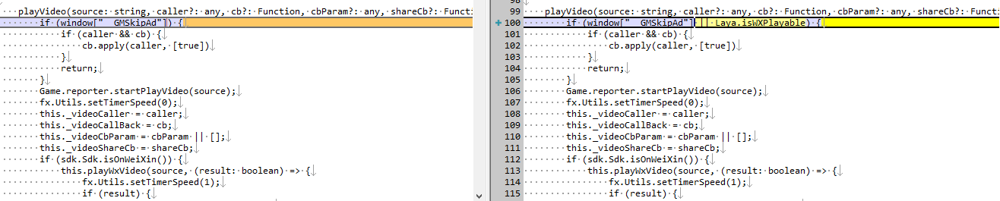
3. GameCfg.ts 与 Define.ts  
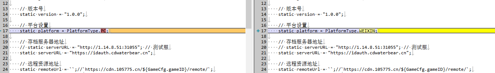
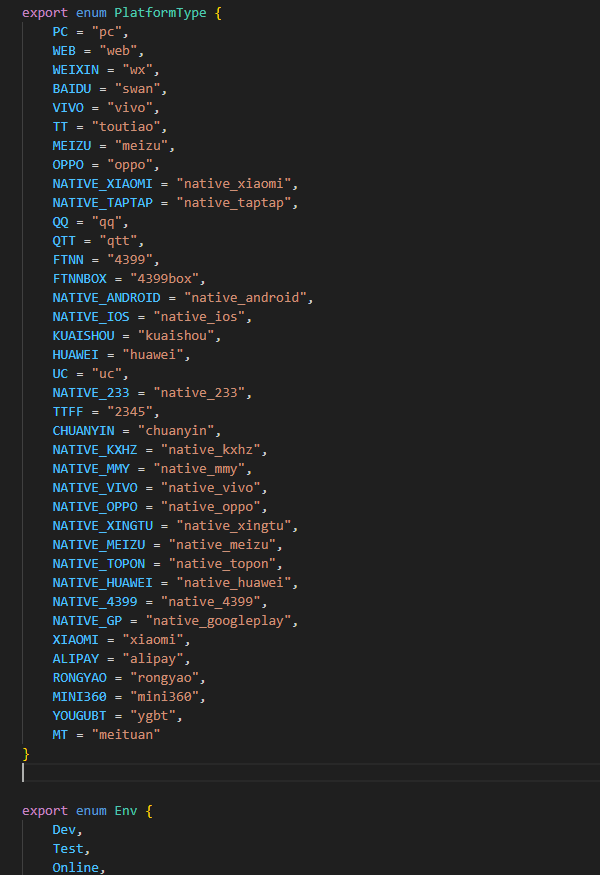
4. Main.ts  
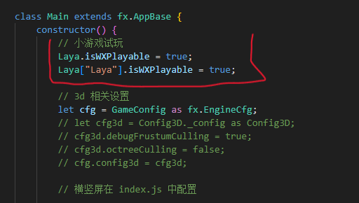
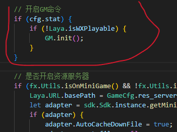

#### 此时启动调试会报错
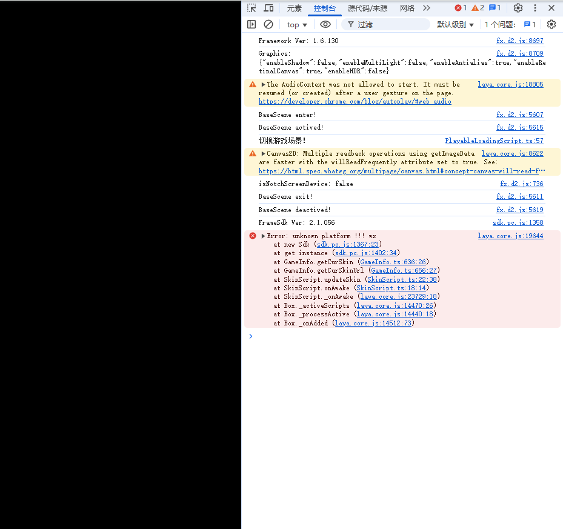

5. Utils.ts
6. LoadingUtil.ts
7. GameScript.ts
- 在 GameScene 场景中删除一些按钮
- 在代码中删除相应的代码
8. Reporter.ts  
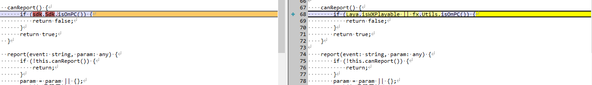
9. User.ts  
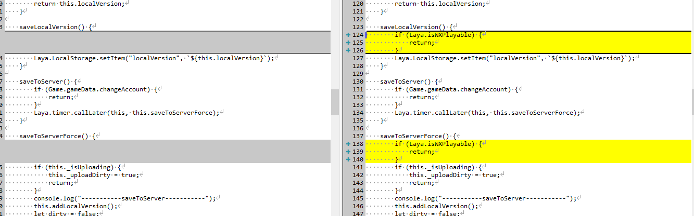
10. 写鸡毛啊，根本写不来，一直报错 unknow platform!!!"