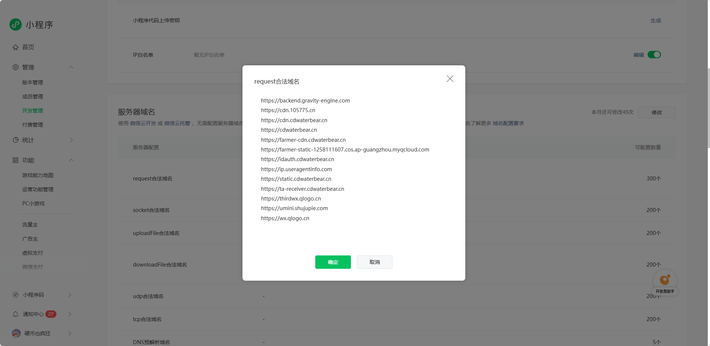
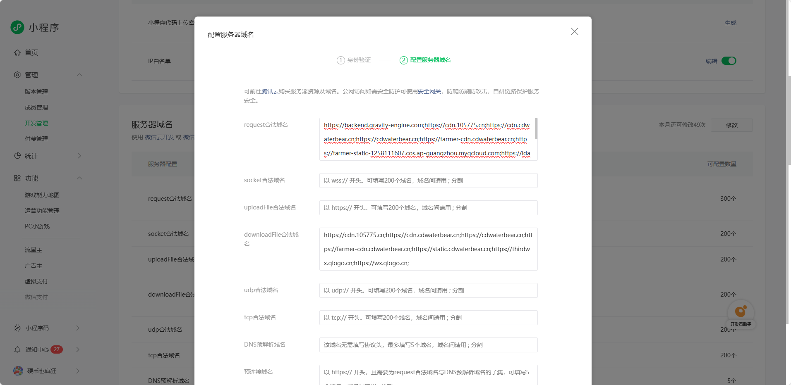

# 只要是接入数数的项目，就需要在微信小程序的开发管理中添加白名单。

## 流程
1. 打开“开发管理”。
2. 找到“服务器域名”，点击右侧修改。
3. 在“request合法域名”中粘贴以下内容：
```
https://backend.gravity-engine.com;
https://cdn.105775.cn;
https://cdn.cdwaterbear.cn;
https://cdwaterbear.cn;
https://farmer-cdn.cdwaterbear.cn;
https://farmer-static-1258111607.cos.ap-guangzhou.myqcloud.com;
https://idauth.cdwaterbear.cn;
https://ip.useragentinfo.com;
https://static.cdwaterbear.cn;
https://ta-receiver.cdwaterbear.cn;
https://thirdwx.qlogo.cn;
https://umini.shujupie.com;
https://wx.qlogo.cn
```
4. 点击保存并提交。



